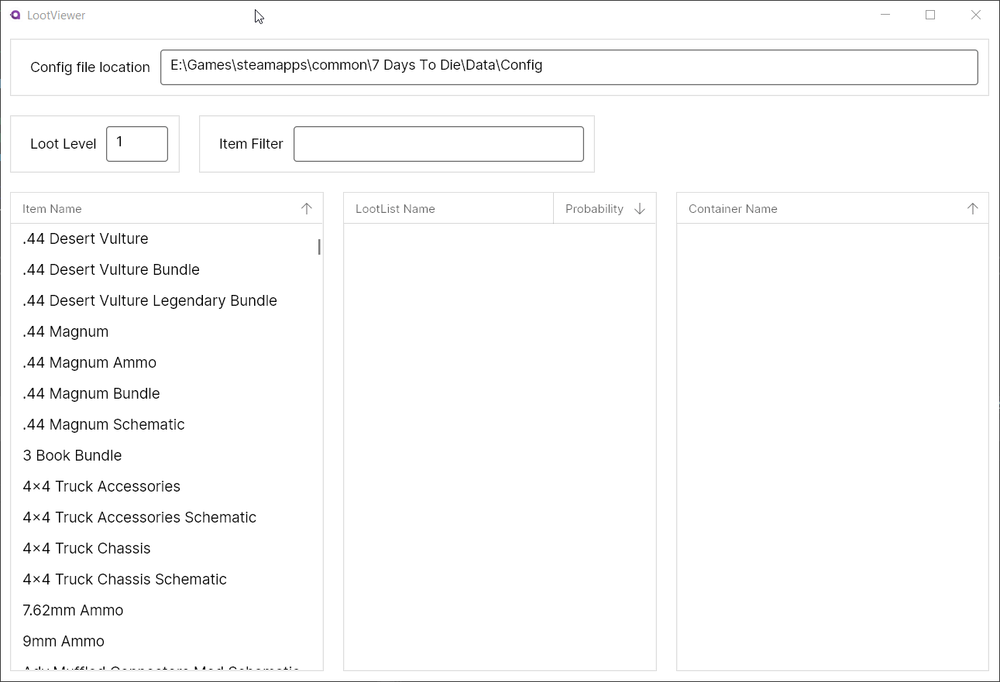

# 7DTD Loot Viewer

A tool for parsing the `loot.xml` file from 7 Days to Die, and working out which items can spawn in which containers  

It is written in .Net Core using AvaloniaUI, and as such, should work on Windows, Mac and Linux

No binaries are currently provided (You would need to build yourself with Visual Studio), I will endeavour to make a release soon

